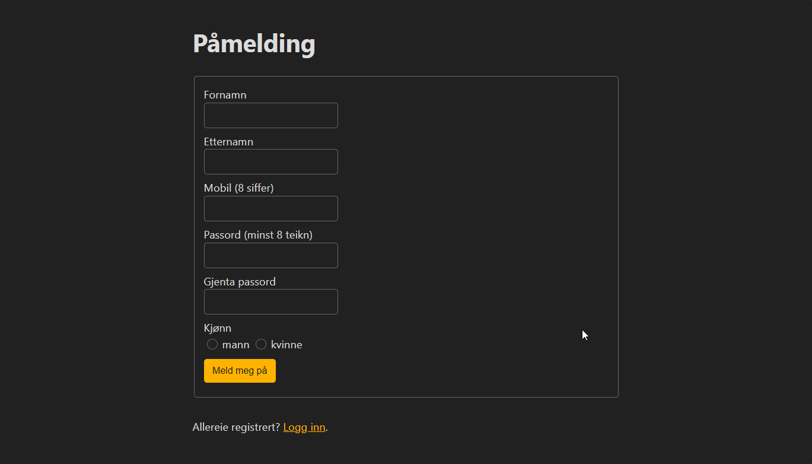
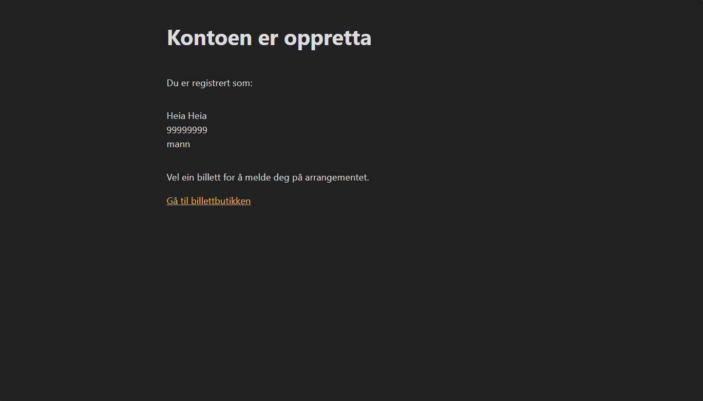
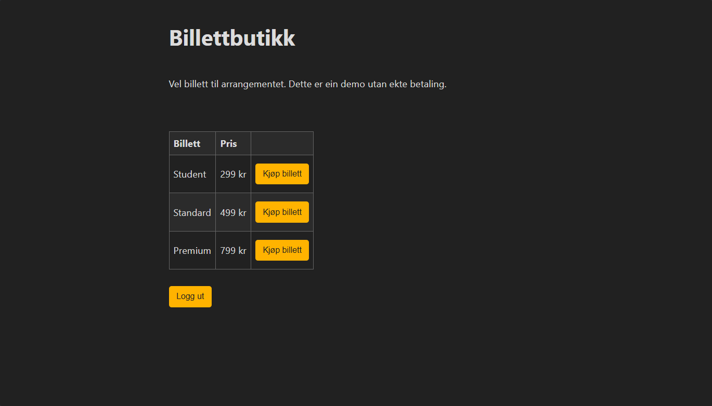
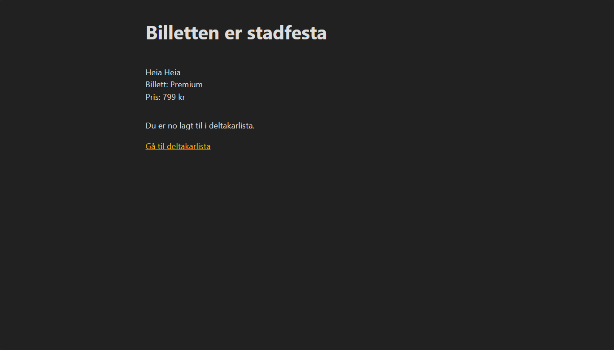
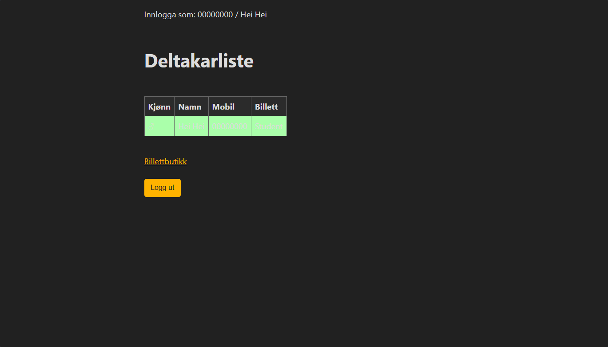
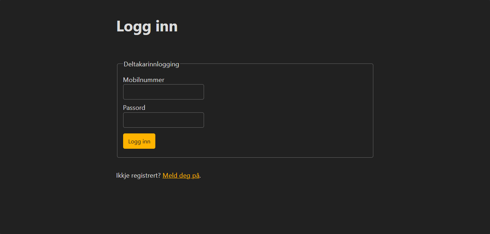
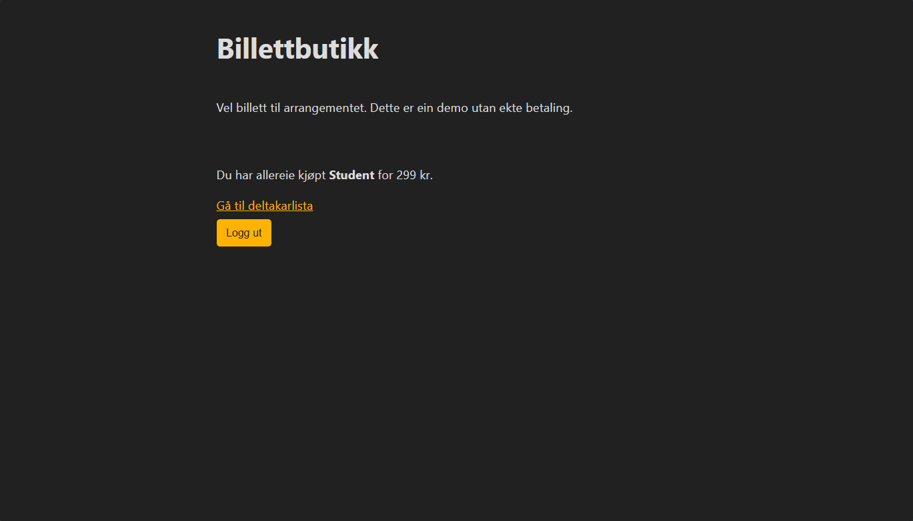

# Arrangement- og billettsystem

Ei Spring Boot-applikasjon for registrering, innlogging, billettkjøp og visning av deltakarar. Prosjektet
brukar Java 17, Spring MVC, Bean Validation, Spring Data JPA, JSP og PostgreSQL.
Passord blir lagra som salta PBKDF2-hashar.

## Funksjonar

- Registrering med server-side validering
- Innlogging med mobilnummer og passord
- Salta PBKDF2-passordhashing
- Sesjonsbasert tilgangskontroll og trygg utlogging
- Tre billettypar med enkel, simulert utsjekking
- Deltakarlista viser berre brukarar med stadfesta billett
- Brukarkontoar og billettkjøp lagra i PostgreSQL
- Containerbasert oppstart med Docker Compose

## Skjermbilete

### 1. Opprett konto



### 2. Kontoen er registrert



### 3. Vel billett



### 4. Stadfest kjøpet



### 5. Sjå deltakarlista



### 6. Logg inn igjen



<details>
<summary>Vis billettbutikk etter gjennomført kjøp</summary>



</details>

## Køyr med Docker

Du treng Docker Desktop med Docker Compose.

1. Kopier `.env.example` til `.env`.
2. Byt ut `DB_PASSWORD` i `.env` med eit lokalt passord.
3. Start applikasjonen:

   ```powershell
   docker compose up --build
   ```

4. Opne <http://localhost:8080/f21/paamelding>. Registrerte brukarar kan
   seinare logge inn på <http://localhost:8080/f21/innlogging>.

PostgreSQL-data blir lagra i Docker-volumet `postgres-data`. Spring/JPA opprettar
og oppdaterer tabellen automatisk ved oppstart.

Stopp containerane med:

```powershell
docker compose down
```

Vil du òg slette lokale databasedata, kan du bruke `docker compose down -v`.

## Testar

```powershell
mvn test
```

Prosjektet inneheld testar for validering og passordverifisering.
